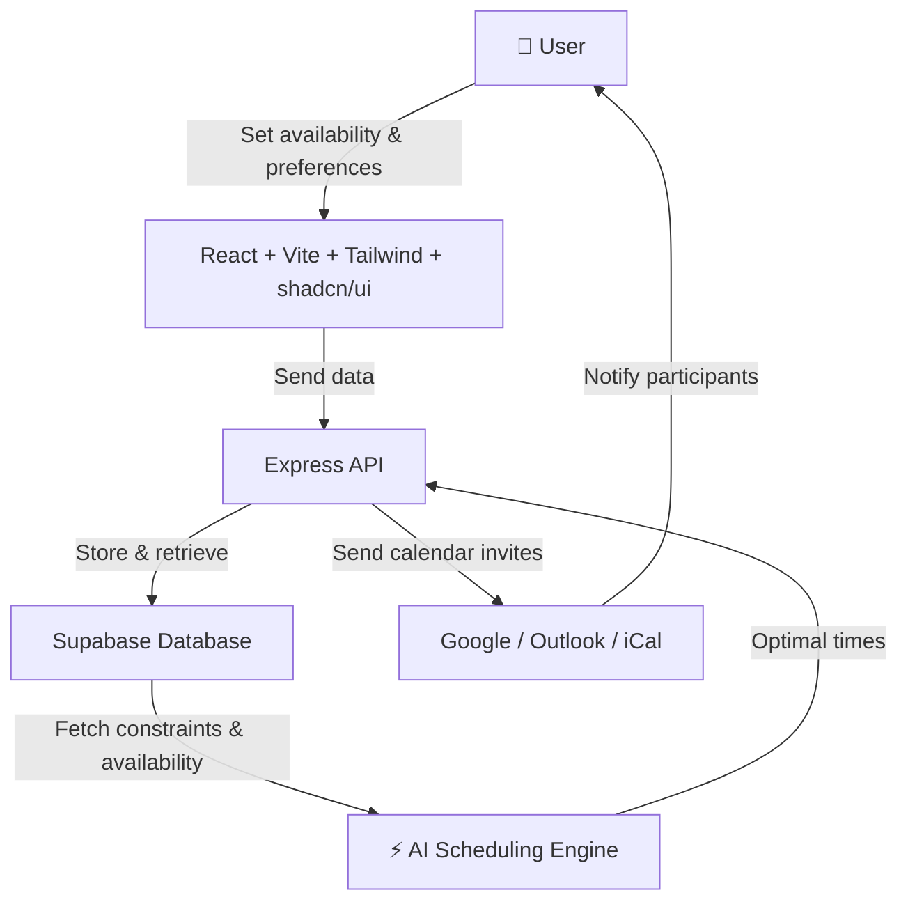

## ⚡ Tech Stack
<p align="center">
  <a href="https://reactjs.org/"></a>
  <a href="https://vitejs.dev/"></a>
  <a href="https://www.typescriptlang.org/"></a>
  <a href="https://tailwindcss.com/"></a>
  <a href="https://supabase.com/"></a>
  <a href="https://expressjs.com/"></a>
  <a href="https://ui.shadcn.com/"></a>
  <a href="#"></a>
</p>

## 📊 Architecture


### Prerequisites
- Node 18+
- pnpm or npm
- Supabase project

### Environment
Create `.env.local` with:

```
NEXT_PUBLIC_SUPABASE_URL=your-url
NEXT_PUBLIC_SUPABASE_ANON_KEY=your-anon-key

# optional fallbacks (outdated)
SUPABASE_URL=your-url
SUPABASE_ANON_KEY=your-anon-key
NEXT_PUBLIC_DEV_SUPABASE_REDIRECT_URL=http://localhost:3000/dashboard
```

### 🗄 Database setup
Run the SQL files found in the `/scripts` directory **in order** using the Supabase SQL editor:
- `scripts/001_create_tables.sql`
- `scripts/002_create_profile_trigger.sql`
- `scripts/003_alter_meetings_add_date_range.sql`
- `etc.`

## 🛠 Quick Start
```
pnpm install
pnpm dev
# Open http://localhost:3000 in your browser
```

### API
- `POST /api/meetings` create meeting
- `GET /api/meetings` list meetings
- `GET /api/meetings/:id` meeting details
- `GET /api/availability?meetingId=...` get current user's availability for meeting
- `POST /api/availability` upsert availability
- `POST /api/schedule` schedule meeting (creator only)

### Notes
- RLS policies protect data; ensure you are signed in to use APIs.
- Realtime updates wired via. `hooks/use-realtime.ts` and `components/realtime-dashboard.tsx`.
